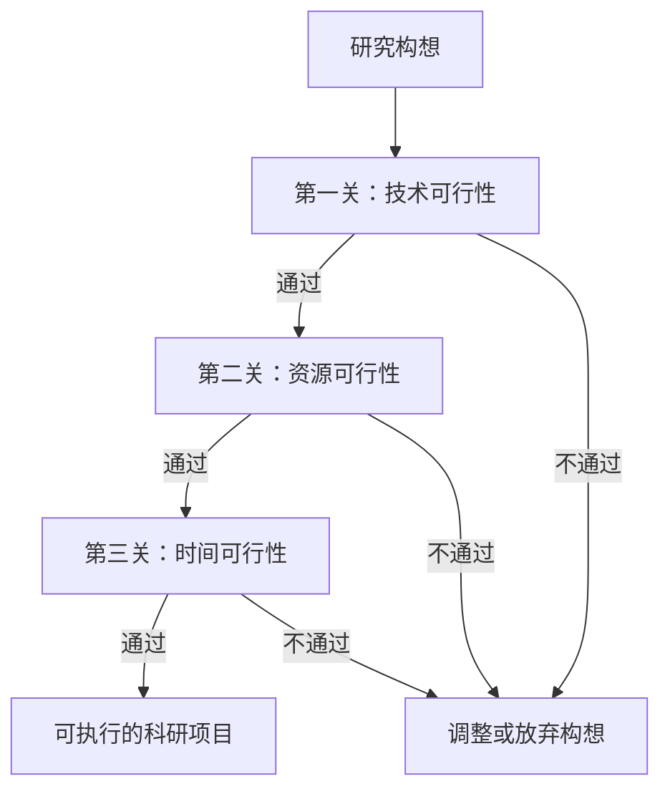

# 第一部分：从需求到问题：找准工科研究的切入点

## 第八节：可行性分析：技术可行性、资源可行性与时间可行性

> **本节核心思想**：一个伟大的研究构想，必须通过“现实”的考验。可行性分析就是在投入大量精力之前，为你的研究项目进行一次全面的“体检”，确保它**做得出来、有条件做、来得及完**。这是工科科研从“空想”走向“实干”的关键一步。

在明确了研究问题与创新点后，许多同学会迫不及待地想要开始动手。请稍等一下！在开启这段科研旅程之前，我们迫切需要一张“现实检查单”——可行性分析。它的目的不是泼冷水，而是用理性、系统的方式，评估你的研究计划是否真正可行，从而**大幅降低后期失败的风险**，让你的科研之路走得更稳。

工科研究的可行性分析通常围绕三个核心维度展开：技术、资源和时间。我们可以将其视为一个“三重过滤网”，你的研究构想需要通过这三重检验，才是一个值得投入的好课题（如图8-1所示）。

### **8.1 技术可行性：这件事在理论上和实践中“能不能做成”？**

这是最首要的一关。你需要回答：我所提出的解决方案，在科学原理和工程技术上是否行得通？

**1. 理论基石是否牢固？**

* **自查问题**：我的方法所依据的科学理论、公式或原理是否成熟、可靠？是否存在理论上的极限或无法逾越的约束？（例如，受到物理定律、计算复杂性、信息论极限等的制约。）
* **案例**：如果你提出一种新的数据压缩算法，首先要检查其压缩率是否逼近了香农熵极限？如果已经接近，那么宣称“大幅提升压缩率”在理论上就极其困难。

**2. 技术路径是否清晰？**

* **自查问题**：实现这个构想的具体技术步骤是什么？是成熟技术的组合应用，还是需要突破某个前沿难点？最大的技术风险点在哪里？
* **行动建议**：进行深入的**预研**。比如，如果你的研究涉及一种新算法，至少应该先查阅文献，看是否有类似思路的实现；或者自己动手复现一篇相关的基础论文，来验证开发环境、核心库函数是否可用。

**3. 技术成熟度如何？**

* **自查问题**：我所依赖的关键技术（如特定的传感器、开源代码库、算法）是处于实验室阶段、已有稳定产品，还是尚在概念期？
* **风险提示**：尽量避免将整个项目的成功，押注在一个尚不稳定、文档不全或由极少数人维护的开源项目上。

> **工科研发思维**：技术可行性分析的本质是 **“降低技术风险”** 。一个优秀的工科生会主动寻找技术风险点，并通过小规模的预实验或仿真来验证关键假设。

### **8.2 资源可行性：我“有没有条件”做这件事？**

技术上行得通，不代表你具备实现的条件。“巧妇难为无米之炊”，资源可行性评估的就是你的“家底”。

**1. 设备与材料资源**

* **硬件**：是否需要特殊的实验设备（如高精度示波器、3D打印机、环境模拟仓）？实验室是否具备？能否预约使用？
* **材料/元器件**：是否需要昂贵的芯片、稀缺的化学试剂或特殊的材料？预算是多少？采购周期多长？

**2. 软件与计算资源**

* **软件许可**：是否需要购买商业软件（如MATLAB、ANSYS、Altium Designer）？实验室是否有正版许可证？
* **计算能力**：训练大型AI模型或进行复杂仿真，需要多强的GPU或CPU？个人电脑能否胜任？是否需要使用学校的高性能计算中心？是否需要云服务（如AWS， Azure） credits？

**3. 数据资源**

* **数据获取**：研究所需的数据集从何而来？是公开数据集（如ImageNet）、需要购买、还是需要自己设计实验采集？
* **数据采集成本**：如果自行采集，成本有多高？例如，采集真实的道路驾驶数据需要车辆、传感器和大量人力。

**4. 人力资源**

* **导师与团队支持**：导师在这个领域是否有足够的经验？是否有师兄师姐可以提供指导？项目是否需要跨学科合作（例如，需要一位自动化专业的同学帮助搭建硬件平台）？

> **工科研发思维**：当资源受限时，要发挥工程师的**优化与替代**能力。思考：能否用免费开源软件（如Python替代MATLAB）？能否用更低成本的传感器（哪怕精度稍低）先验证核心想法？能否通过合作共享资源？

### **8.3 时间可行性：我“来不来得及”在毕业前完成？**

这是学位研究中最残酷、也最现实的约束。时间可行性分析直接决定了你的研究计划是否靠谱。

**1. 任务分解与耗时估算**

* **方法**：将整个研究项目分解为更小的、可管理的任务（例如：文献综述、学习仿真软件、搭建实验台、设计算法、进行第一组实验、数据分析、论文撰写等）。
* **关键**：为每个任务估算一个 **“保守的”** 时间。记住“霍夫斯塔特定律”：一件事实际花费的时间总会比你预计的长，即使你已经考虑了这一定律。**务必为每个阶段预留15%-20%的缓冲时间。**

**2. 识别关键路径**

* **概念**：关键路径是指那些一旦延迟，就会导致整个项目延期的一系列任务。
* **案例**：你的“硬件实验”依赖于“定制PCB板”，而PCB板的制作又依赖于“电路设计”。那么“电路设计->投板->焊接调试”就是一条关键路径。你必须优先保证这些任务顺利进行。

**3. 与学业里程碑对齐**

* **行动**：明确你的开题、中期考核、论文提交的最终日期。然后采用**倒推法**，设定每个时间点必须达成的里程碑（例如，在中期时，必须完成所有核心实验）。

> **工科研发思维**：强烈建议在此就使用**甘特图**（详见第二部分）来可视化你的时间计划。一张清晰的甘特图是时间可行性最有力的证明，也能让你和导师对进度有一致的期望。

### **8.4 综合权衡与风险应对策略**

在现实中，技术、资源、时间三者常常相互制约。你需要做出权衡：

* **技术 vs. 资源**：最先进的方案可能最烧钱。能否在保证核心创新点的前提下，采用更经济的替代方案？
* **技术 vs. 时间**：一个更完美的解决方案可能需要漫长开发期。能否先实现一个“最小可行产品”（MVP）来验证核心思想，后续再完善？
* **资源 vs. 时间**：投入更多人力（资源）可以缩短时间，但需要协调成本。

**可行性分析的最终输出，不应只是一个“行”或“不行”的结论，而应是一份“风险识别与应对计划”**。诚实地指出项目潜在的风险（如“算法收敛速度可能达不到实时要求”），并提出应对策略（如“准备备用算法B”），这远比一份盲目乐观的计划更显专业和可靠。

### **| 本节行动指南 |**

请拿出你的研究设想，完成以下可行性自查清单：

1. **技术可行性自查**
    * [ ] 我能否清晰地描述实现我创新点的核心技术路径？
    * [ ] 我已通过文献检索和预研，确认该路径没有原则性错误。
    * [ ] 我了解实现过程中可能遇到的主要技术难点。

2. **资源可行性自查**
    * [ ] 我已确认实验室具备或可获取所需的软硬件设备。
    * [ ] 我已明确研究所需的数据来源及其获取成本。
    * [ ] 我已与导师讨论过，并确认能获得必要的指导。

3. **时间可行性自查**
    * [ ] 我已将整个研究项目分解为若干个小任务（建议超过10个）。
    * [ ] 我已为每个任务估算了保守的时间，并预留了缓冲。
    * [ ] 我已画出初步的甘特图，并确保其符合学业时间节点。

**总结：** 充分的可行性分析，是你送给未来自己的一份“保险”。它不能保证100%成功，但能确保你起步于坚实的大地，而非漂浮的云端。完成这份分析，你的研究蓝图就已描绘完毕，可以自信地进入下一个阶段——制定详实的科研计划。

---
