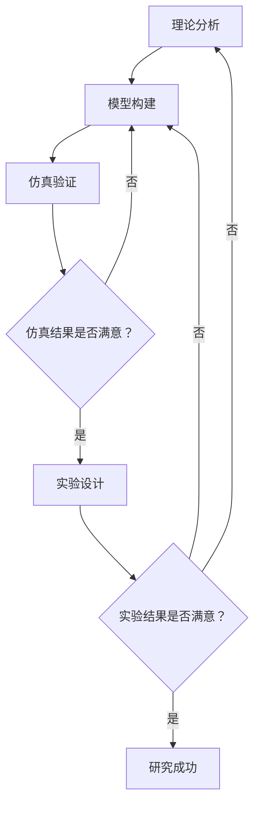

### **第四部分：设计研究方法论：工科研究的蓝图**

工科研究不仅要有好的想法，更要有将想法变为可信结论的系统化方法。本部分将深入探讨如何设计一套严谨、可执行的研究方法论，这是整个研究项目的核心与蓝图。一个清晰的方法论不仅能让你的工作有条不紊，更能让论文审稿人和读者信服你的研究是科学、可靠的。

#### **第一节：总体研究路线图设计：理论分析、模型构建、仿真验证、实验设计**

任何一项坚实的工科研究，都不是一蹴而就的。它遵循一个从抽象思维到具体实践、从理想环境到真实场景的逐层递进过程。我们将这个过程的顶层规划称为**总体研究路线图**。一个经典的路线图包含四个关键阶段：**理论分析、模型构建、仿真验证和实验设计**。掌握这个路线图，就如同拥有了一张通往成功研究的导航图。

**核心思想：** 这四个阶段构成了一个**螺旋式上升的闭环系统**，而非简单的线性流程。后一阶段的结果很可能会迫使你回到前一阶段进行修正和优化，这个过程正是研究不断深化、成果不断坚实的体现。

为了让阐述更具体，我们将以一个案例贯穿始终：**【设计一种基于深度学习的无人机轻量化机翼结构损伤识别算法】**。

---

##### **1. 理论分析：为研究奠基**

* **目的**：在动手做任何具体工作之前，先从理论上回答“**为什么**”和“**是否可能**”的问题。这是整个研究的基石，确保你的工作不是无根之木。

* **核心任务**：
    1. **问题形式化**：用精确的语言定义问题。例如，将“识别机翼损伤”转化为“一个基于振动信号的多分类问题”，并明确损伤类型（裂纹、腐蚀等）的类别。
    2. **机理探究**：深入分析问题背后的科学原理。在本案例中，需要理解：结构损伤如何改变其动力特性（如模态频率、振型）？振动信号与损伤类型、位置、大小之间存在怎样的映射关系？
    3. **可行性论证**：基于现有理论，论证你设想方法的可行性。例如，深度学习（如卷积神经网络CNN）理论上被证明是强大的特征提取器和分类器，那么它理应能够从复杂的振动信号中学习到损伤的特征模式。

* **输出成果**：一段严谨的理论论述，可能包含初步的数学公式（如结构动力学基本方程）、文献综述得出的理论依据，以及明确的研究假设（如“本文假设机翼的损伤状态与其振动响应频谱存在可被深度学习模型识别的映射关系”）。

* **常见误区**：跳过理论分析，直接“调包”跑代码。这会导致研究方向模糊，遇到问题时不知其所以然。

---

##### **2. 模型构建：将思想具象化**

* **目的**：将理论分析阶段形成的想法，构建成一个**可计算、可操作**的具体模型。这是连接思想与实践的桥梁。

* **核心任务**：
    1. **抽象与简化**：抓住核心要素，忽略次要因素。例如，在建立机翼的力学模型时，可能先将其简化为梁或板模型，而非完全复刻每一个螺丝。
    2. **模型表达**：
        * **数学模型**：描述振动信号与损伤关系的方程。
        * **算法模型**：设计具体的深度学习网络结构（如1D-CNN用于处理振动时序信号），明确输入（原始加速度数据）、输出（损伤概率）、损失函数和优化算法。
    3. **定义接口**：明确模型的输入/输出格式、需要调整的参数（超参数）。

* **输出成果**：一个清晰的模型描述，包括算法伪代码、网络结构图、数学表达式、或物理模型的CAD图纸。

* **与理论分析的关系**：理论分析证明了“用CNN是合理的”，模型构建则具体回答了“用**什么样**的CNN”。

---

##### **3. 仿真验证：在数字世界中的首轮试炼**

* **目的**：在投入成本高昂的物理实验之前，在计算机模拟环境中，对构建的模型进行**高效、低成本、全面的性能评估和参数调优**。

* **核心任务**：
    1. **平台搭建**：选择仿真工具。例如，使用ANSYS或Abaqus进行有限元分析（FEA），模拟机翼在健康状态和各种损伤状态下的振动响应，生成大量带标签的仿真数据。
    2. **场景设计**：在仿真中设置各种工况（不同飞行姿态、不同损伤程度和位置），测试模型的鲁棒性。
    3. **与基线对比**：在相同的仿真数据上，将你的深度学习模型与传统的损伤识别方法（如基于频率变化的方法）进行性能对比。

* **输出成果**：一系列仿真结果图表（如准确率、召回率随损伤程度变化的曲线）、模型在仿真环境下的性能基线，以及初步的模型优化版本。

* **重要性**：仿真可以**安全地**暴露模型在极端条件下的缺陷，允许你快速迭代（修改模型结构、调整参数），而无需担心损坏物理设备。它是风险控制和效率提升的关键。

---

##### **4. 实验设计：在物理世界中的终极考验**

* **目的**：最终在真实的物理系统上，**验证模型在现实条件下的有效性、可靠性和实用价值**。这是工科研究说服力的终极体现。

* **核心任务**：
    1. **实验台搭建**：制作真实的机翼实验件（可预设人工损伤），搭建包含加速度传感器、激振器、数据采集卡等的实验平台。
    2. **严谨设计**：明确实验变量（**自变量**：损伤类型/大小；**因变量**：识别准确率；**控制变量**：激励信号、环境温度等）。确保实验可重复。
    3. **数据采集与分析**：采集真实振动数据，输入到训练好的模型中进行识别，统计性能指标。

* **输出成果**：真实的实验数据、模型在实验数据上的性能报告、与仿真结果的对比分析。

* **与仿真验证的关系**：仿真是在“理想温室”中测试，而实验则面临“现实风雨”（如传感器噪声、材料不均匀、连接间隙等）。**实验结果与仿真结果的差异本身往往能带来新的发现和讨论**。例如，如果仿真效果很好但实验效果不佳，可能需要思考：仿真模型是否过度简化？是否存在未建模的动态？

---

##### **路线图的灵魂：迭代与闭环**

真正的科研路线图是一个动态循环的过程，如下图所示：

* **仿真驱动迭代**：如果仿真结果不理想，你需要回到**模型构建**阶段，甚至反思**理论分析**的假设是否成立。
* **实验驱动迭代**：如果实验结果不理想，你可能需要回溯到**模型构建**（调整算法），也可能需要回溯到**理论分析**（重新审视物理机理），甚至可能需要改进**仿真验证**的模型以更好地逼近现实。

**总结：**
掌握“理论分析→模型构建→仿真验证→实验设计”这一研究路线图，意味着你掌握了工科科研的“元方法”。它不仅能帮助你规划自己的研究，更能让你具备批判性审阅他人工作的能力。在接下来的章节中，我们将深入这个路线图中的每一个环节，手把手地教你如何将它们具体落地。
