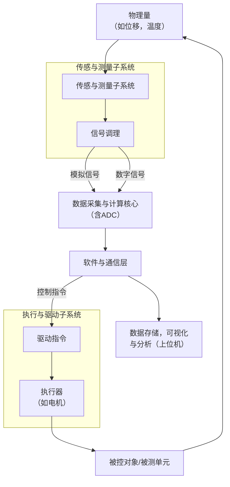

### **第五部分：实验设计与数据收集：获取可靠的证据**

#### **第四节：硬件实验台搭建与数据采集系统**

**核心引导语：**
如果说仿真是在理想的数字世界中验证想法，那么硬件实验台就是让想法在复杂的物理世界中接受洗礼。本节将带你走过从零到一搭建一个可靠、可信的硬件实验系统的全过程。我们的目标不仅仅是“让灯亮起来”，更是要**构建一个能产生高质量、可重复、有说服力数据的科学测量系统**，为你的研究结论提供最坚实的支撑。

---

##### **4.1 明确目标：实验台设计的“北极星”**

在拿起螺丝刀和电烙铁之前，你必须回归研究的原点。硬件实验台的所有设计决策都应服务于一个终极目标：**有效且高效地验证你的研究假设**。

* **关键自问：**
  * **我要验证什么？** 实验台需要测量哪些关键数据来回答你的研究问题？（例如，新控制算法的跟踪精度、新材料的承载能力、新通信协议的传输延迟）。
  * **指标如何映射？** 实验台的测量能力必须直接覆盖你在“5.5 性能评估指标的定义”中确定的所有核心指标。
  * **边界条件是什么？** 预算、空间、时间、安全性是现实约束。一个优秀的工科生懂得在约束内寻求最优解，而不是追求不切实际的“高配”。

**工科思维：** 实验台不是越复杂越好，而是**越贴合目标越好**。一个旨在测试长期可靠性的实验台，和一个专注于测量毫秒级动态响应的实验台，其设计哲学和器件选型将天差地别。

##### **4.2 系统分解：构建实验台的“骨架”**

将一个复杂的实验台视为由多个子系统组成的整体，是管理的核心。下图清晰地展示了一个典型硬件实验数据采集系统的核心构成与数据流：

**1. 被控对象/被测单元**
这是你的研究载体。可能是自制的机构（机器人、无人机），也可能是现有的设备（发动机、电路板）。**关键**在于确保其一致性和代表性，避免因加工误差或装配问题引入干扰变量。

**2. 执行与驱动子系统**
负责“做功”。根据需求选择电机（伺服、步进）、气缸、功率放大器等。

* **选型要点：** 扭矩/推力、速度、精度、带宽。务必**留有余量**，避免器件始终工作于极限状态，影响寿命和性能。

**3. 传感与测量子系统（数据的“眼睛”）**
这是数据可信度的基石。选择传感器（位移、力、加速度、温度、摄像头等）时，需深究：

* **精度、分辨率与量程：** 传感器的精度必须显著高于你希望验证的系统精度。
* **奈奎斯特采样定理：** 这是铁律！采样频率必须高于信号最高频率的2倍以上（工程上常用5-10倍），否则会出现**混叠失真**，数据完全失效。
* **噪声应对：** 真实世界充满噪声。需采用屏蔽线、差分测量、硬件滤波等手段确保信号纯净。

**4. 数据采集与计算核心（系统的“大脑”）**
负责信号转换、逻辑运算与控制。

* **选型决策：**
  * **高实时性、确定性控制（如机器人、电机控制）？** -> 首选**实时操作系统** 或 **FPGA**。
  * **需要复杂算法和友好界面？** -> **微控制器 + 上位机** 是经典组合。
* **ADC：** 模数转换器的位数决定量化精度，采样率必须满足采样定理。

**5. 软件与通信层（系统的“神经网络”）**

* **固件：** 运行在下位机（如STM32， Arduino）中，负责底层、实时任务。
* **上位机软件：** 提供人机界面，用于参数设置、监控、数据存储与可视化。常用工具有LabVIEW， MATLAB/Simulink， Python（PyQt/Tkinter）。
* **通信协议：** 根据速度、距离和可靠性需求选择UART， I2C， SPI， CAN， Ethernet等。

##### **4.3 集成、调试与标定：从“图纸”到“信任”**

这是将蓝图变为可靠系统的关键步骤，也是最考验工程能力的地方。

* **黄金法则：分步集成，逐级测试**
    1. **静态测试：** 不供电，检查线路连接是否正确、牢固。
    2. **上电测试：** 单独给传感器、执行器上电，验证其基本功能。
    3. **开环测试：** 在开环下验证每个输入输出通道是否正常工作。
    4. **闭环测试：** 最后才进行闭环控制，并从非常保守的参数开始。

* **调试方法论：**
  * **二分法排查：** 出现问题时，从信号链的中间点切入（如数据采集卡的输入/输出），快速定位问题是出在前端（传感器/信号调理）还是后端（控制算法/执行器）。
  * **示波器是你的“瑞士军刀”：** 永远相信示波器上看到的真实电压波形，它是判断信号质量、时序问题的终极工具。

* **标定：建立测量的“准绳”**
    **标定是赋予测量数据“绝对可信度”的过程。** 必须使用更高精度的标准器（如标准砝码、激光干涉仪、高精度万用表）来校准你的测量系统，得到“读数”与“真值”之间的换算关系（如拟合曲线），从而消除系统误差。**未经标定的测量系统，其数据是存疑的。**

##### **4.4 数据采集与管理：从信号到证据**

实验台的最终产出是可用于分析的高质量数据。

* **数据流管道：** 理解数据从物理世界到硬盘的完整旅程：`物理量 -> 传感器信号 -> 信号调理 -> ADC采样 -> 软件采集 -> 数据存储`。
* **数据管理与可复现性：**
  * **存储格式：** 使用通用、高效的格式（如 `.csv`, `.h5`, `.mat`）。
  * **规范命名与日志：** 每个数据文件都应包含实验编号、日期、条件参数（如 `exp01_20241007_speed500rpm.csv`）。**详细的实验日志**是生命线，记录任何异常或观察。
  * **版本控制：** 对重要的采集代码和配置文件使用Git等工具进行版本管理。
  * **安全备份：** 数据是无价的，必须定期备份。

##### **4.5 伦理、安全与可复现性**

* **安全第一：** 涉及高压、高速、高温的实验，必须将安全规范置于首位，如佩戴护目镜、规范操作。
* **学术伦理：** 真实记录所有数据，包括与预期不符的“坏”数据。绝不能为了匹配预期结果而修改原始数据。
* **可复现性：** 你的实验台搭建记录、接线图、代码、参数设置应足够详细，以便他人能够复现你的工作。这是工科科研的基本要求。

**本节小结：**
硬件实验台的搭建，是理论通往实践的桥梁，是工科科研中最具挑战也最能体现综合能力的环节。它训练的不仅是动手能力，更是**系统思维、严谨态度和解决复杂工程问题的韧性**。一个设计精良、运行稳定、数据可靠的实验台，其本身就是你科研能力的最佳证明。
