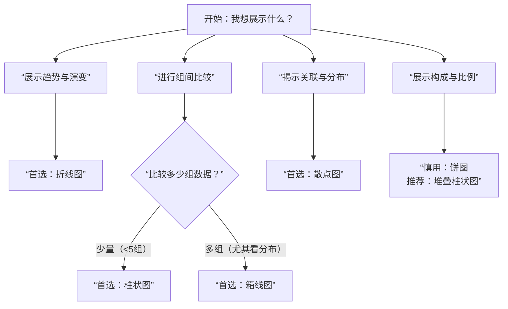

### **第六部分：数据分析与讨论**

#### **第一节：数据可视化：用图表清晰展示结果**

> **核心提示：** 工科科研中，一张优秀的图表胜过千言万语。它的首要使命不是“好看”，而是“说清事”。本节将帮助你掌握用图表进行有效论证的技巧，让你的研究结果一目了然。

经过严谨的实验设计与辛苦的数据收集，你手中已经掌握了宝贵的第一手数据。然而，杂乱无章的数据本身无法说话。数据可视化的任务，就是将这些数字转化为直观的视觉形式，让你、你的导师以及论文评审人能够迅速理解数据背后的规律、比较和故事。

**一、 核心理念：图表是工科论证的“视觉语言”**

请首先建立以下核心认知：

1. **目的驱动**：在动手画图之前，必须明确：**“我想用这张图证明什么？”** 图表是为了服务你的论点，而不是数据的简单堆砌。它应当直接或间接地回应你在引言中提出的研究问题。
2. **服务于论证**：图表是你论证链条中最直观的证据。它应该能清晰地展示出你的方法是否有效、为何有效、以及比现有方法好在哪里。
3. **可复现性是底线**：图表中的所有数据点必须源于你的原始数据，确保其真实、准确。任何修饰都不能歪曲数据本身的事实。

**二、 工科图表选择的“第一性原理”**

选择哪种图表，不取决于你会画哪种，而取决于你想要讲述的“数据故事”类型。下图提供了清晰的决策路径：

**三、 四大核心图表类型详解与工科应用**

**1. 折线图：展示趋势与演变**

* **适用场景**：显示一个变量随另一个**连续变量**（如时间、迭代次数、频率、温度）变化的趋势。
* **工科实例**：
  * **算法性能**：损失函数随训练迭代次数的收敛曲线。
  * **系统监控**：网络吞吐量随时间的变化。
  * **参数扫描**：电机效率随负载变化的曲线。
* **绘制要点**：
  * **多条线对比**：用醒目的颜色和线型（实线、虚线、点划线）区分，并配以清晰图例。
  * **添加误差带**：如果数据有波动，用阴影表示标准差或置信区间，以体现稳定性和可靠性。
  * **关键点标记**：在转折点、极值点等处进行标记和注释。

**2. 柱状图/箱线图：进行组间比较**

* **柱状图**
  * **适用场景**：比较**不同类别**之间**某个单一指标**（如平均值）的差异。类别是离散的（如算法A、B、C；材料X、Y、Z）。
  * **绘制要点**：
    * 柱状图的宽度应一致，间距适中。
    * **必须添加误差棒！** 误差棒（通常为标准差或标准误）能直观反映数据的波动范围，是科学性的体现。
    * 如果类别名称过长，可考虑将柱子横放（条形图）。

* **箱线图**
  * **适用场景**：当需要比较不同组别数据的**整体分布**时，箱线图比柱状图提供的信息丰富得多。它能一次性展示中位数、上下四分位数、可能异常值等。
  * **绘制要点**：
    * 学会解读箱线图：箱体代表中间50%的数据，箱体内的线是中位数，“须”的末端通常是非异常值的极值，外部点是异常值。
    * 在需要严谨说明数据分布形态时（如证明你的算法输出更稳定），箱线图是首选。

**3. 散点图：揭示关联与分布**

* **适用场景**：探讨两个变量之间是否存在**相关关系**，或观察数据点的分布情况。
* **工科实例**：
  * 研究发动机油耗与转速的关系。
  * 展示不同特征的数据点在二维空间中的聚类效果。
  * 绘制预测值与真实值的相关散点图，评估模型精度。
* **绘制要点**：
  * 可以添加**趋势线**（如线性拟合）并给出拟合公式和R²值，量化相关程度。
  * 当数据点密度过大时，可使用**热力图** 来显示分布密度。

**4. 饼图：展示构成与比例（慎用！）**

* **适用场景**：**极其有限**。仅当需要显示一个整体中各个部分的占比，且部分数量很少（通常3-5个），且占比差异明显时，方可考虑。
* **工科警示**：**尽量避免使用饼图**。人眼对角度和面积的感知远不如对长度敏感。当需要比较多个组成部分时，**堆叠柱状图** 是远比饼图更佳的选择。

**四、 工科图表绘制的“黄金法则”**

1. **清晰自明**：图表应有自明性，即不读正文也能理解大意。确保：
    * **标题明确**：标题应是一个描述性短语或简要结论，如“本文方法在不同信噪比下的性能优势”，而非简单的“性能比较”。
    * **坐标轴清晰**：每个坐标轴都必须有明确的**标签和单位**（如“时间 (s)”, “准确率 (%)”）。
    * **图例无误**：图例应清晰区分不同数据系列，且与图形元素准确对应。

2. **简约即美**：坚决摒弃所有“图表垃圾”。
    * 禁用花哨的3D效果、渐变填充、网格线，除非它们承载数据信息。
    * 背景应为白色或浅色，避免干扰。

3. **考虑无障碍性**：假设论文被黑白打印，你的图表是否仍能读？
    * 用**线型**（实、虚、点）和**标记点**（圆、方、三角）来辅助颜色进行区分。
    * 避免使用红绿色盲难以分辨的颜色组合。

**五、 常见误区与提升技巧**

* **误区1：Y轴刻度不从0开始**——这会严重夸大微小差异，是学术不端的表现之一（除非有特殊科学理由，并明确说明）。
* **误区2：隐藏不利数据**——即使某个对比结果不理想，也应如实呈现，并在讨论中诚实分析原因。
* **提升技巧：显著性标记**：在需要进行统计检验时，在柱状图上方使用星号（*）等标记注明显著性水平（如，*p < 0.05, **p < 0.01），显得非常专业。

**总结与行动点**

在绘制图表前，请进行自我提问：

1. **我的论点是什么？** （这张图要证明什么？）
2. **数据关系是什么类型？** （趋势、比较、关联、构成？ -> 参考决策图）
3. **图表是否清晰、准确、自明？** （检查标题、坐标轴、图例、误差棒）
4. **图表是否经得起黑白打印的考验？**

优秀的数据可视化，是你科研素养和专业精神的直接体现。它不仅能让你更深刻地理解自己的数据，更能极大地增强论文的说服力，让评审人和读者迅速抓住你工作的价值。

---
**下一节预告**：学会了用图表“展示”结果后，第六部分第二节将带你进入《定量数据分析：统计分析、显著性检验》，学习如何用数学工具从数据中提取可靠的结论，判断差异是否真实存在。
