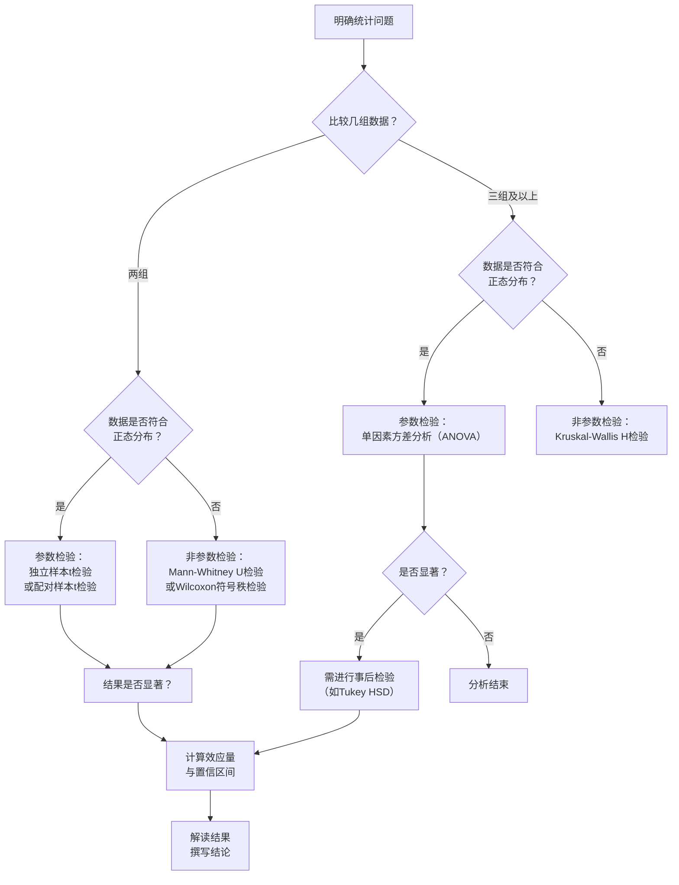

### **第六部分：数据分析与讨论：从数据到洞察**

#### **6.2 定量数据分析：统计分析、显著性检验**

在完成了数据可视化的初步探索后，我们进入了更为核心的环节——定量数据分析。本节的目的，是为你提供一套严谨的统计工具，用以回答一个关键的工科研究问题：**我所观察到的差异或效果，是真实存在的，还是仅仅源于随机波动？**

切记，工科研究的结论不应建立在“看起来更好”的主观感觉上，而应立足于“统计上显著”的客观证据。

---

##### **6.2.1 分析前的准备：从研究问题到统计问题**

在运行任何统计检验之前，必须明确你的目标。回顾你的研究假设和实验设计（第五部分），将之转化为可检验的统计问题。

* **比较差异**：“方法A的吞吐量是否**显著高于**方法B？” -> 使用**显著性检验**（如t检验）。
* **分析关系**：“传感器读数与真实温度是否**强相关**？” -> 使用**相关性与回归分析**。
* **描述分布**：“系统在95%的情况下响应时间**低于多少毫秒**？” -> 使用**描述性统计**（如百分位数）。

**数据预处理**是保证分析质量的基石。确保你已处理了异常值、缺失值，并进行了**探索性数据分析**，例如通过箱线图观察数据分布和异常点。

---

##### **6.2.2 描述性统计：用数字描绘数据全貌**

描述性统计是总结和描述数据集基本特征的第一步。

* **集中趋势**：表示数据的“中心”位置。
  * **均值**：平均值，对极端值敏感。
  * **中位数**：中间值，对异常值不敏感。**在工科性能数据（如延迟、能耗）常呈偏态分布时，中位数比均值更具代表性。**
* **离散程度**：表示数据的波动范围。
  * **标准差/方差**：衡量数据点与均值的平均偏离程度。值越大，数据越分散。
  * **四分位距**：第75百分位数与第25百分位数之差，描述了中间50%数据的范围，不受极端值影响。

**最佳实践**：在论文中，应同时报告反映集中趋势的指标（均值或中位数）和反映离散程度的指标（标准差或四分位距），例如：“新方法的延迟中位数为25ms（IQR: 20-30ms）”。

---

##### **6.2.3 统计推断与显著性检验：超越表象**

这是定量分析的核心，旨在从样本数据推断总体规律。

**1. 核心概念：虚无假设、备择假设与p值**

* **虚无假设**：通常是你希望*推翻*的假设，例如“方法A与方法B的性能**没有差异**”。
* **备择假设**：是你希望*支持*的假设，例如“方法A与方法B的性能**存在差异**”。
* **显著性水平**：一个预先设定的阈值（通常为α = 0.05）。它是我们拒绝虚无假设时所能容忍的犯错风险（第一类错误）。
* **p值**：**这是最容易被误解的概念。** p值是指在**虚无假设为真**的条件下，观察到当前实验数据（或更极端数据）的概率。
  * **正确解读**：如果p值很小（如p < 0.05），意味着在“没有差异”的假设下，观察到当前的差异是一件概率很低的事件。因此，我们有理由拒绝虚无假设，认为差异很可能真实存在。
  * **严重误区**：p值**不是**你的发现为真的概率，也**不是**效应大小的度量。

**2. 常用显著性检验方法选择指南**

你的数据特征决定了检验方法的选择。下图展示了如何根据你的研究问题和数据条件，选择最合适的显著性检验方法：

**重要提示**：使用参数检验（如t检验、ANOVA）前，通常需要验证数据是否满足**正态性**（可用Shapiro-Wilk检验）和**方差齐性**等前提条件。如不满足，应选择对应的非参数检验，因为后者更为稳健。

---

##### **6.2.4 超越p值：效应量与置信区间——衡量实际意义**

一个具有统计显著性的结果，在现实中可能微不足道。因此，现代工科研究强烈建议报告**效应量**和**置信区间**。

* **效应量**：**它回答了“差异有多大？”** 它量化了处理效应的大小，使其结果在不同研究间可比。
  * **常用指标**：Cohen's d（用于t检验，d=0.8表示大的效应）、Eta平方（用于ANOVA）。
  * **举例**：新算法将速度提升了0.1%，p<0.05，统计显著。但计算出的Cohen's d值极小（如0.01），表明该优化在工程上**实际意义不大**。

* **置信区间**：提供了一个可能包含真实效应值的范围（如95% CI）。它不仅可用于判断显著性（若区间不包含0，则显著），还显示了估计的**精度**（区间越窄，估计越精确）。

---

##### **6.2.5 结果呈现与学术规范**

**1. 如何在论文中撰写结果**

避免干巴巴地只写p值。应完整、规范地报告统计结果。

* **范例**：“为比较两种算法的能耗，我们进行了独立样本t检验。结果发现，新算法（M = 5.2 J, SD = 0.8）的能耗显著低于基线算法（M = 7.1 J, SD = 1.0），t(38) = 2.45, p = .019。计算得到的Cohen's d为0.78，表明具有中等至大的效应量。95%的置信区间为[-3.5, -0.3]，进一步支持了这一结论。”

**2. 学术诚信与最佳实践**

* **避免p-hacking**：不要在收集数据后反复尝试不同的分析或组合直到得到显著p值。这属于学术不端。应在实验前就确定分析方案。
* **注意多重比较问题**：当对同一数据集进行多次显著性检验时，偶然出现显著结果的概率会增加。此时应考虑使用**多重比较校正**（如Bonferroni校正）。
* **可复现性**：详细说明你使用的统计检验、软件/工具包（如Python的Scipy/statsmodels、R、SPSS）以及所有参数设置。

---

**总结与衔接**：通过本节的定量分析，你为你的研究假设提供了坚实的、量化的证据。下一步（6.3 结果讨论）的任务，就是对这些统计结论进行深入的、逻辑性的解释：**为什么你的方法会更优？其背后的物理原理或技术机制是什么？你的结果在何种条件下成立，又有何局限性？** 至此，你的工科研究完成了从数据到证据，再从证据到洞察的完整跨越。
